<div align="center">

# ♻️ KitaKitar
### *An AI-Powered Recycling Game: Sort Smarter, Earn Points, and Drive Climate Action*

<p align="center">
  
  
  
  
  
</p>

<p align="center">
  
  
  
  
  
</p>

---

### 🌍 *KitaKitar* means **“We Recycle”** in Bahasa Malaysia 
An AI-driven platform that turns climate action into a **rewarding game—scan your waste, hit the nearest recycling hub, and earn points** to unlock real-world rewards.

</div>

---

## ✨ Overview

**KitaKitar** is a full-stack recycling platform designed to make recycling:

- **Simple** → scan waste with your phone
- **Smart** → get AI-powered material detection and guidance
- **Accessible** → find nearby recycling centers instantly
- **Motivating** → earn points and compete on leaderboards
- **Scalable** → centers manage operations through a dedicated web panel
- **Innovative** → **smart bin + QR redemption workflow**

> 💡 The idea is simple:  
> If people recycle less because it’s **confusing, inconvenient, and unrewarding**, then KitaKitar turns it into a **guided, gamified, AI-assisted experience**.

---

# 📸 Product Preview

> Real screenshots from the current build.

## Mobile App
<div align="center">
  <table>
    <tr>
      <th>Scan Waste</th>
      <th>AI Chat</th>
      <th>Nearby Centers</th>
      <th>Leaderboard</th>
      <th>Scan Result</th>
      <th>User Profile</th>
    </tr>
    <tr>
      <td align="center">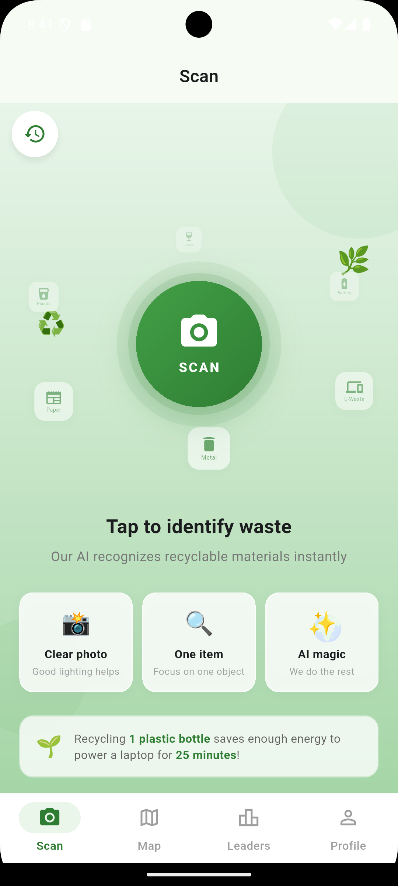</td>
      <td align="center">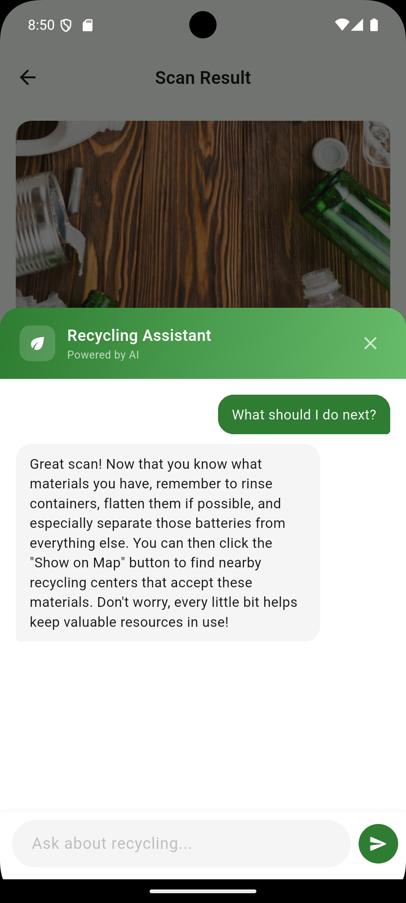</td>
      <td align="center">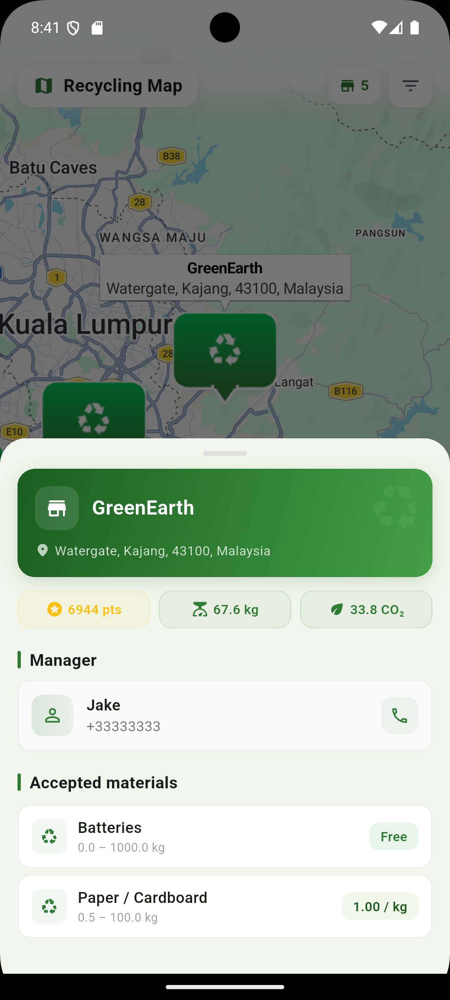</td>
      <td align="center">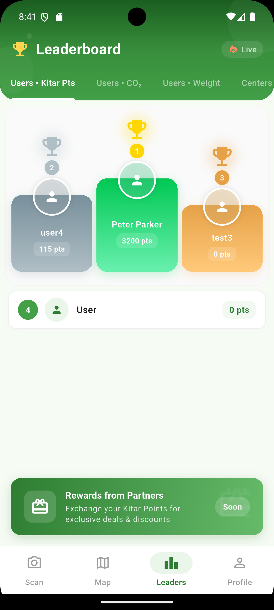</td>
      <td align="center">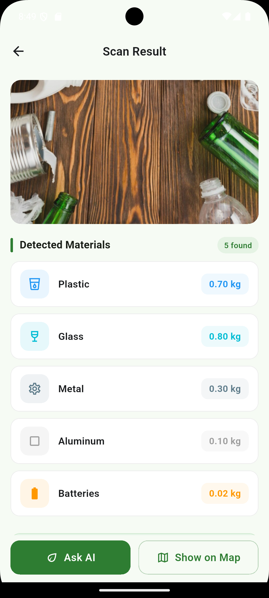</td>
      <td align="center">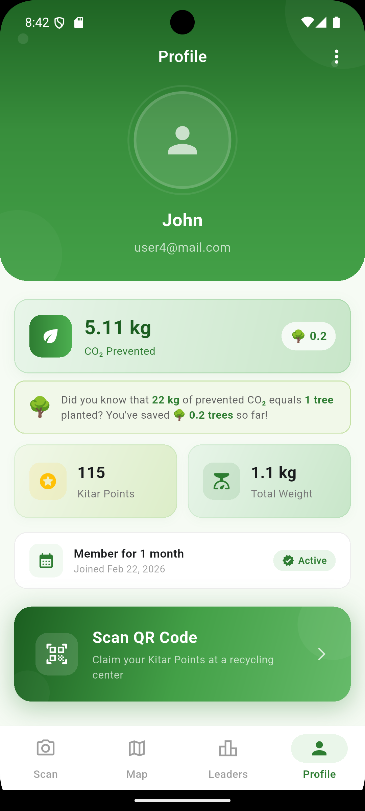</td>
    </tr>
  </table>
</div>

## Admin / Center Web Panel
| Dashboard | Center Management | Transactions |
|-----------|-------------------|--------------|
| 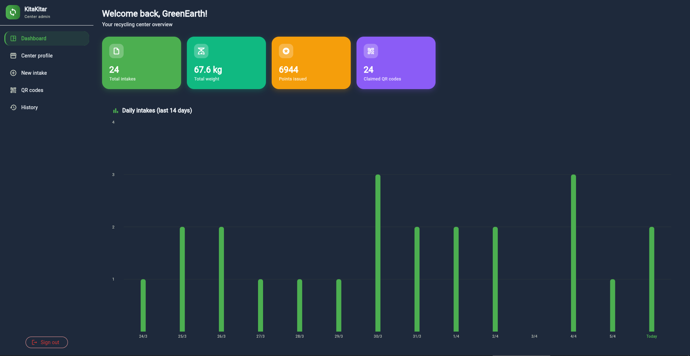 | 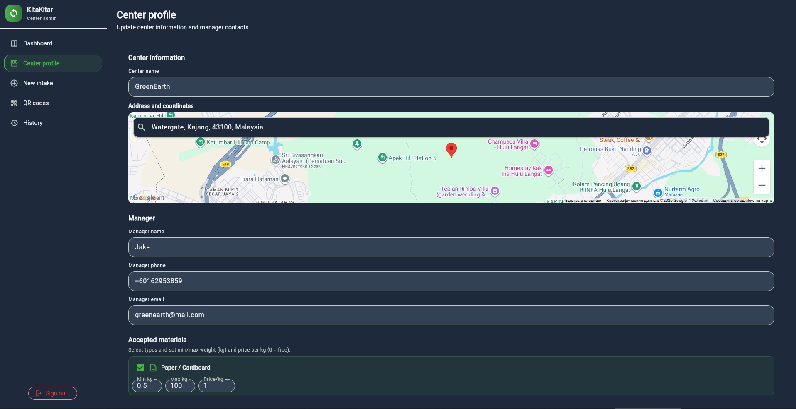 | 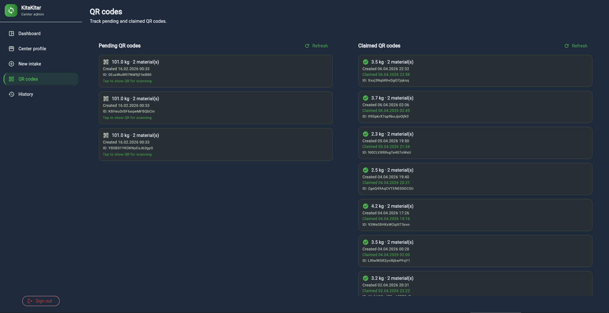 |

## Smart Bin
<div align="center">
  <table>
    <tr>
      <th>ESP32-CAM Intake</th>
      <th>QR Reward Generation</th>
    </tr>
    <tr>
      <td align="center">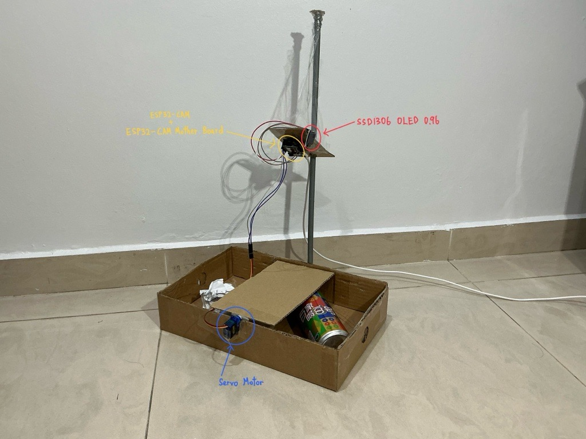</td>
      <td align="center">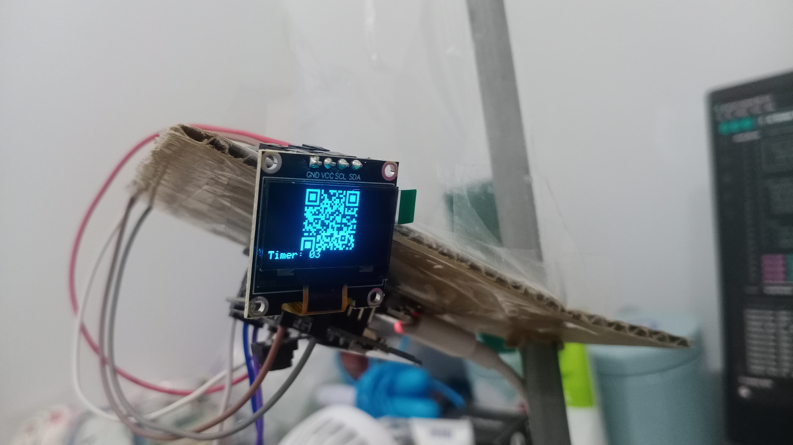</td>
    </tr>
  </table>
</div>

### KitaKitar Demo Video

[](https://youtu.be/47avtMvRYpY)

---

# 🧠 Why This Matters

## The Problem

Recycling rates stay low because many users face the same friction points:

- ❓ **“What material is this?”**
- 🧴 **“Do I need to clean it first?”**
- 📍 **“Where do I bring it?”**
- 🤷 **“Is it even worth the effort?”**

As a result:
- recyclable waste often ends up in **landfills**
- contamination reduces recycling efficiency
- people lose trust because recycling feels **unclear and inconvenient**

---

# 🌱 SDG Alignment

## 🎯 United Nations Sustainable Development Goal

### **SDG 13 — Climate Action**

Improper waste disposal contributes to:

- methane emissions from landfills
- unnecessary incineration
- avoidable resource extraction
- higher carbon footprints

**KitaKitar** helps reduce this by making proper waste sorting and recycling easier at the **individual and community level**.

---

# 🚀 Core Value Proposition

## KitaKitar turns recycling into a loop:

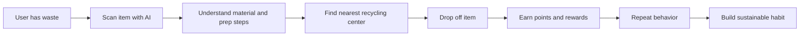

---

# 🧩 Product Components

## 1) 📱 Mobile App (`mobile/`)
The consumer-facing recycling experience.

### Key capabilities
- 🔐 Authentication (Email/Password + Google Sign-In)
- 📷 AI waste scanning
- 💬 Recycling assistant chat
- 🗺 Nearby recycling center map
- 🏆 Leaderboards and gamification
- 👤 User profile management
- 🔳 QR reward scanner

---

## 2) 🖥 Center Web Panel (`center_web/`)
The operations layer for recycling centers.

### Key capabilities
- 🔐 Secure center login
- 🏢 Register / manage center details
- ♻️ Manage accepted materials
- 📍 Map-based location setup
- 📦 Process recycling intake transactions

---

## 3) 🤖 Smart Bin System (`smart_bin/`)
An IoT-assisted workflow for automated intake.

### Key capabilities
- 📸 ESP32-CAM image capture
- 🧠 server-side classification
- 🧾 automatic QR reward generation
- 🔗 Firebase integration for redemption

---

# 🌟 Feature Highlights

## 📱 Mobile Experience

| Feature | Description | User Value |
|--------|-------------|------------|
| **AI Scan** | Camera-based material recognition | Removes guesswork |
| **AI Chat** | Follow-up recycling guidance | Educates users |
| **Map** | Find nearby centers | Reduces inconvenience |
| **QR Scanner** | Redeem drop-off rewards | Creates incentive |
| **Leaderboards** | Gamified ranking | Encourages repeat use |
| **Profile** | Track progress & identity | Builds retention |

---

## 🖥 Center Web Experience

| Feature | Description | Operational Value |
|--------|-------------|-------------------|
| **Center Login** | Secure manager access | Controlled administration |
| **Dashboard** | Manage center data | Centralized operations |
| **Material Config** | Define accepted waste | Cleaner sorting logic |
| **Transactions** | Track intake records | Accountability & reporting |
| **Maps Integration** | Register precise center location | Better discoverability |

---

# 🤖 AI in KitaKitar

AI is not a gimmick here — it is the **core usability layer**.

## 1) Vision AI — Waste Recognition
**Model:** `gemini-2.5-flash`

Used to:
- identify likely material type
- estimate recyclable category
- reduce user confusion
- provide immediate sorting confidence

### Example outputs
- Plastic bottle
- Aluminum can
- Cardboard packaging
- Glass jar
- Mixed / unclear item

---

## 2) Conversational AI — Recycling Assistant
**Model:** `gemma-3-27b-it`

Used to answer:
- “Can I recycle this if it has food residue?”
- “Do I need to remove the cap?”
- “Why is this not accepted?”
- “What happens after I drop this off?”

This turns KitaKitar into both a **tool** and a **learning system**.

---

# 🧠 AI Workflow

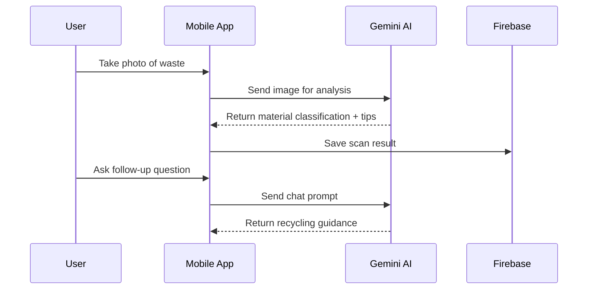

---

# 🗺 User Journey

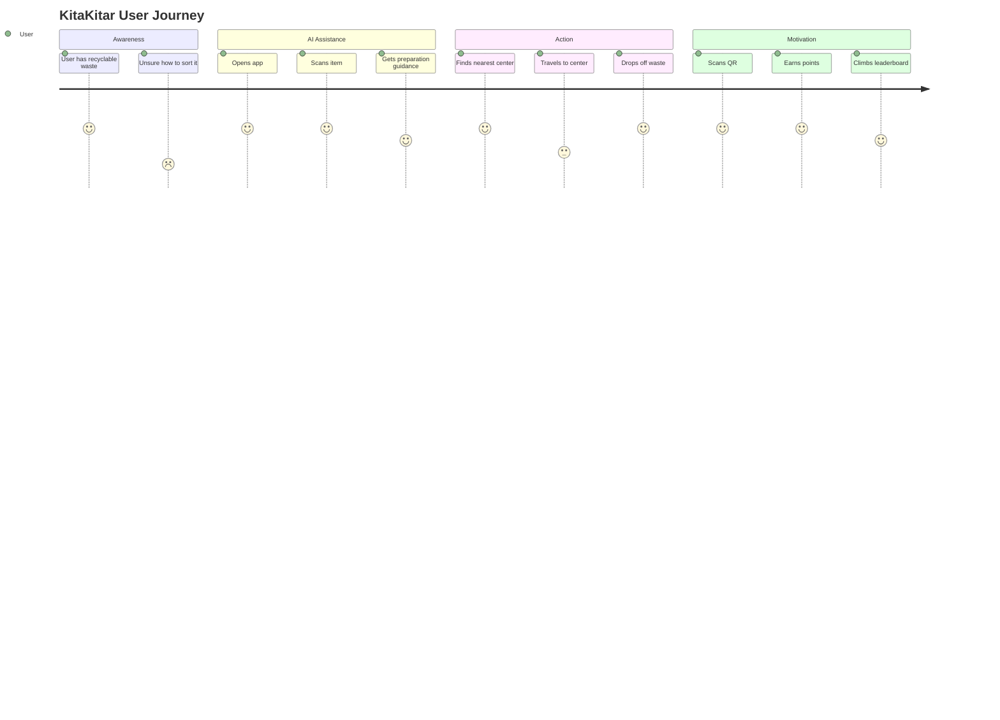

---

# 🏗 System Architecture

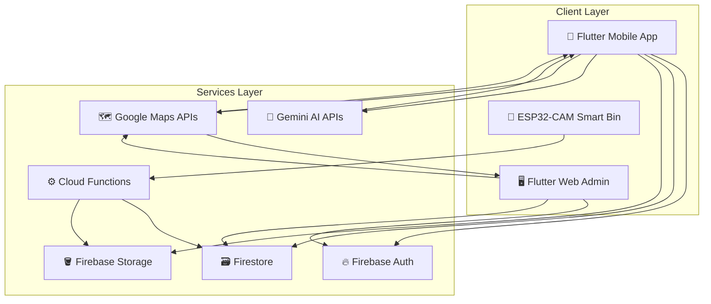

---

# 🧰 Tech Stack

## Frontend
- **Flutter** (Mobile + Web)

## Backend / Infrastructure
- **Firebase Authentication**
- **Cloud Firestore**
- **Firebase Storage**
- **Firebase Cloud Functions**

## AI
- **Google Gemini API**
  - `gemini-2.5-flash` → image / material recognition
  - `gemma-3-27b-it` → conversational recycling assistant

## Maps & Geolocation
- **Google Maps SDK** (Mobile)
- **Google Maps JavaScript API** (Web)
- **Places API**

## IoT / Smart Bin
- **ESP32-CAM**
- **Python server**
- **QR generation workflow**

---

# 📊 Impact Dashboard


## Intended Impact Funnel

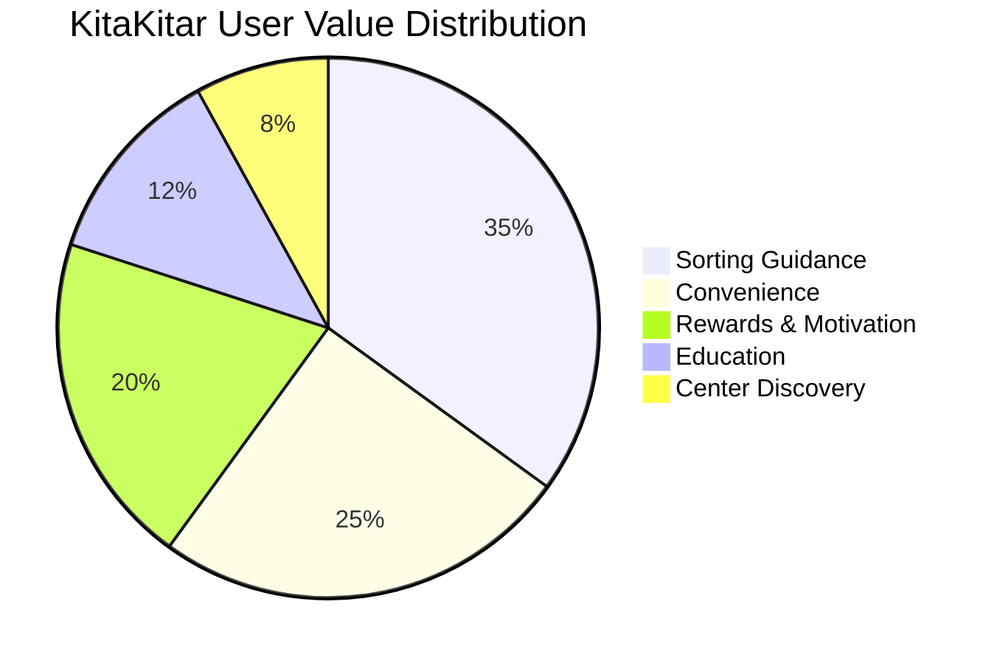

## Sustainability Outcome Model

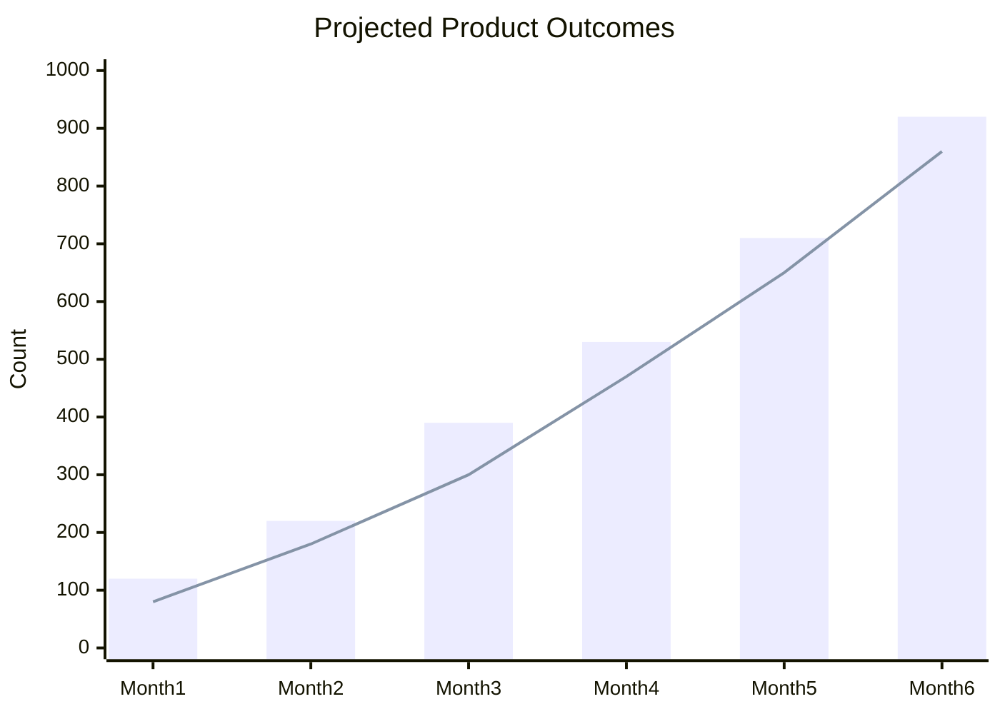

**Interpretation (example):**
- **Bars** → total AI-assisted scans
- **Line** → successful recycling transactions


---

# 📦 Repository Structure

```bash
KitaKitar/
├── mobile/                  # Flutter mobile app
│   ├── lib/
│   │   ├── main.dart
│   │   ├── config/          # AI config (Gemini API key)
│   │   ├── models/          # Data models
│   │   ├── services/        # Firebase, AI, Chat, Maps, QR services
│   │   ├── providers/       # State management
│   │   └── screens/
│   │       ├── auth/
│   │       ├── main/
│   │       ├── scan/
│   │       ├── map/
│   │       ├── leaders/
│   │       ├── profile/
│   │       └── qr/
│   └── pubspec.yaml
│
├── center_web/              # Flutter web panel for recycling centers
│   ├── lib/
│   │   ├── main.dart
│   │   ├── config/          # Maps API key
│   │   ├── models/
│   │   ├── services/
│   │   └── providers/
│   ├── web/
│   │   └── index.html
│   └── pubspec.yaml
│
├── smart_bin/               # ESP32-CAM + Python server
│   ├── KitaKitar.ino
│   ├── server.py
│   └── requirements.txt
│
├── firebase/
│   ├── functions/           # Cloud Functions (TypeScript)
│   └── firestore.rules      # Firestore security rules
│
└── README.md
```

---

# 🗃 Firebase Data Model

## Main Collections

| Collection | Purpose |
|-----------|---------|
| `/users` | Mobile app users |
| `/centers` | Registered recycling centers |
| `/centers/{centerId}/materials` | Accepted material definitions |
| `/materials` | Global material reference |
| `/ai_scans` | AI scan results |
| `/transactions` | Recycling drop-off transactions |
| `/qr_codes` | One-time QR reward codes |
| `/leaderboards` | Cached ranking data |

---

# 🧬 Firestore Relationship Overview

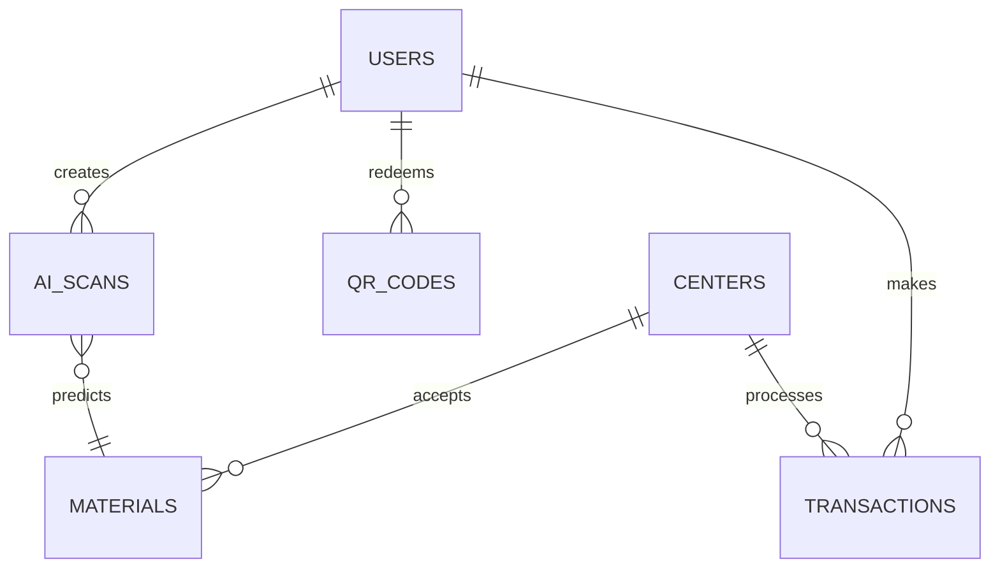

---

# ⚙️ Prerequisites

Before running the project, ensure you have:

- **Flutter SDK** (latest stable)
- **Android Studio / Xcode**
- **Firebase project**
- **Google Cloud account**
- **Google Maps APIs enabled**
- **Gemini API key**
- *(Optional)* Python environment for `smart_bin/`

---

# 🔑 API Keys Overview

The project uses **3 main Google Cloud-related configurations**:

| # | Service | Used In | Purpose | Storage |
|---|---------|--------|---------|---------|
| 1 | **Firebase** | `mobile/`, `center_web/` | Auth, Firestore, Storage | `firebase_options.dart`, `google-services.json`, `GoogleService-Info.plist` |
| 2 | **Gemini AI** | `mobile/` | AI scan + chat | `.env` or `--dart-define` |
| 3 | **Google Maps** | `mobile/`, `center_web/` | Maps, Places, center location | local config / `.env` / script tag |

---

# 🚀 Setup Guide

# 1) Clone the Repository

```bash
git clone <repository-url>
cd KitaKitar
```

---

# 2) Install Dependencies

## Mobile App
```bash
cd mobile
flutter pub get
```

## Center Web Panel
```bash
cd ../center_web
flutter pub get
```

---

# 3) Configure Firebase

## Option A — FlutterFire CLI *(Recommended)*

```bash
# Mobile app
cd mobile
flutterfire configure

# Center web panel
cd ../center_web
flutterfire configure
```

This generates:

- `lib/firebase_options.dart`
- platform-specific Firebase config references

---

## Option B — Manual Setup

1. Create a Firebase project
2. Enable:
   - Authentication
   - Firestore
   - Storage
3. Download platform configs:

### Android
Place in:
```bash
mobile/android/app/google-services.json
```


### Web
Configure:
```bash
center_web/lib/firebase_options.dart
```

---

# 4) Configure Gemini AI

Used for:
- waste scanning
- recycling assistant chat

## Get API Key
Create one from:
- **Google AI Studio**

Enable:
- **Generative Language API**

## Mobile `.env`
```env
# mobile/.env
GEMINI_API_KEY=YOUR_GEMINI_API_KEY
```

## Or via Dart Define
```bash
cd mobile
flutter run --dart-define=GEMINI_API_KEY=YOUR_GEMINI_API_KEY
```

> If no key is provided, the app falls back to **mock AI responses**.

---

# 5) Configure Google Maps API

Enable these APIs in Google Cloud:

- **Maps SDK for Android**
- **Maps SDK for iOS**
- **Maps JavaScript API**
- **Places API**

---

## Android
Add to:

```properties
mobile/android/local.properties
```

```properties
GOOGLE_MAPS_API_KEY=YOUR_GOOGLE_MAPS_API_KEY
```


---

## Web Admin Panel


Update:

```html
center_web/web/index.html
```

```html
<script src="https://maps.googleapis.com/maps/api/js?key=PASTE_YOUR_GOOGLE_MAPS_API_KEY_HERE&libraries=places&loading=async" async defer></script>
```

---

# 6) Configure Google Sign-In

1. Enable **Google** in Firebase Auth
2. Add Android SHA-1:

```bash
keytool -list -v -keystore ~/.android/debug.keystore -alias androiddebugkey -storepass android -keypass android
```

3. Configure iOS OAuth client if needed

---

# 7) Deploy Firestore Rules

```bash
cd firebase
firebase deploy --only firestore:rules
```

> Current rules are suitable for testing.  
> Harden them before production deployment.

---

# 8) Run the Apps

## Mobile App
```bash
cd mobile
flutter run
```

Or with explicit key:
```bash
flutter run --dart-define=GEMINI_API_KEY=YOUR_GEMINI_API_KEY
```

## Center Web Panel
```bash
cd center_web
flutter run -d chrome
```

---

# 9) Smart Bin

The `smart_bin/` system supports **camera capture → classification → QR generation**. People can dispose of recyclables at a shared bin that **recognizes items**, logs the intake, and **issues a reward QR** linked to Firebase—so earning points in the game does not depend on queuing at a desk or filling forms. By turning a ordinary street or campus facility into a **fast, frictionless “play surface”** for the same scan–earn–leaderboard loop as the app, it lowers effort at the moment of action and **reinforces the habit**; we believe that seamless, visible rewards at the bin will keep users coming back and make the experience feel **effortless and compelling**—the kind of smooth, repeatable win that strong games use to deepen engagement.

### Required Components

- `ESP32 Cam`
- `ESP32 Cam Mother Board`
- `Servo Motor`
- `SSD1306 OLED 0.96`
- `Jumper Wires`
- `Type C Cable`

### Hardware Configuration

| ESP32-CAM | Servo wire |
|-----------|---------|
| GPIO 12 Pin | Yellow / Orange Wire |
| 5V Pin | Red Wire |
| GND pin | Brown / Black Wire |

| ESP32-CAM | SSD1306 OLED 0.96 |
|-----------|---------|
| GND Pin | GND Pin |
| 3.3V Pin | VCC Pin |
| GPIO 15 Pin | SCL Pin |
| GPIO 14 Pin | SDA Pin |


### Required Prerequisites - Firebase Credentials (.json file)

1. Go to **Firebase Console**
2. Select your project
3. Open settings
4. Project Settings → Service accounts
5. Generate key (Click **“Generate new private key”**)
6. Download file

You will get a .json file like **"kitakitar-smart-bin-firebase-adminsdk-abcde-1234567890.json"**, this is your Firebase Credentials.

### Arduino IDE Setup Guide

## ESP32 Environment
1. Open **Arduino IDE**
2. Go to **File → Preferences**
3. Add these two URLs to **Additional Boards Manager URLs**:
   ```
   https://dl.espressif.com/dl/package_esp32_index.json
   https://raw.githubusercontent.com/espressif/arduino-esp32/gh-pages/package_esp32_index.json
   ```
4. Click "OK" button → "OK" button
5. Go to **Tools → Board → Boards Manager...**
6. Search for **“esp32”** and install the latest version by Espressif Systems

## Customize Library
1. Open **Arduino IDE**
2. Go to **Sketch → Include Library → Add .ZIP Library...**
3. Select `smart_bin/ei-kitakitar-arduino-1.0.1.zip`

## General Library
1. Open **Arduino IDE**
2. Go to **Sketch → Include Library → Manage Libraries...**
3. Search for **"ESP32Servo"** by Kevin Harrington, John K. Bennett and install it
4. Search for **"WebSockets"** by Markus Sattler and install it
5. Search for **"ArduinoJson"** by Benoit Blanchon and install it
6. Search for **"Adafruit SSD1306"** by Adafruit and install it
7. Search for **"Adafruit GFX Library"** by Adafruit and install it

### Install Python dependencies
```bash
cd smart_bin
pip install -r requirements.txt
```

### Run

1. Change your **file location** for your Firebase Credentials (*Line 63* in `smart_bin/server.py`)
2. Change your **Wifi Name** (*Line 78* in `smart_bin/smart_bin.ino`)
3. Change your **Wifi Password** (*Line 79* in `smart_bin/smart_bin.ino`)
4. Change your **PC's LAN IP** (*Line 80* in `smart_bin/smart_bin.ino`)
5. Connect your **PC** and **ESP32 Cam** using *Type C Cable*
6. Open **Arduino IDE**
7. Go to Tools → Board → esp32 → **AI Thinker ESP32-CAM**
8. Choose your own **Port**
9. Click **Upload** button
10. After done uploading, click the **Reset** button on ESP32 Cam or ESP32 Cam Mother Board
11. Go to Tools → Serial Monitor (115200 baud)
12. 
```bash
cd smart_bin
python server.py
```
13. Now your KitaKitar Smart Bin is ready!

### Material Mapping
- `can` → stored as **aluminum**, weight = **0.015 kg**
- `paper` → weight = **0.005 kg**

---

# 🔄 End-to-End Reward Flow

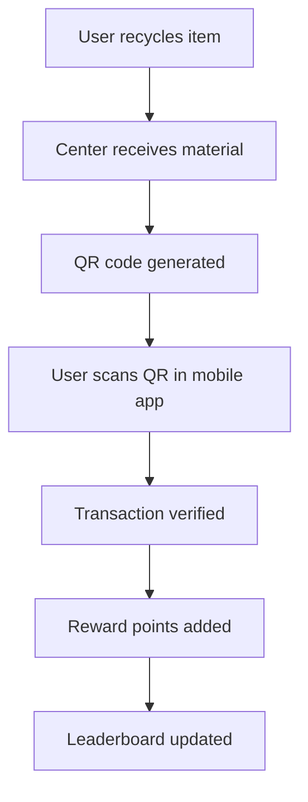

---

# 🔐 Security Notes

## Sensitive Config
Never commit:
- `.env`
- service account JSON
- local platform secrets
- unrestricted API keys

## Recommended Production Hardening
- Restrict **Maps API keys** by:
  - package name (Android)
  - bundle ID (iOS)
  - HTTP referrer (Web)
- Restrict Gemini API usage
- Tighten Firestore rules
- Add server-side validation for rewards and QR redemption

---

# 🛠 Development Notes

## AI Development Mode
To skip real AI calls during testing:

```dart
useMockResponse = true
```

Found in:
```bash
mobile/lib/config/ai_config.dart
```

---

## Cloud Functions
Deploy backend functions:

```bash
firebase deploy --only functions
```

---

## Firestore Rules
Deploy database rules:

```bash
firebase deploy --only firestore:rules
```

---

# 🧪 Troubleshooting

# Build Errors

Try:

```bash
flutter clean
flutter pub get
```

If needed, clear Gradle cache (Windows PowerShell):

```powershell
Remove-Item -Recurse -Force $env:USERPROFILE\.gradle
```

---

# Firestore Permission Denied

Make sure rules are deployed:

```bash
cd firebase
firebase deploy --only firestore:rules
```

---

# Google Maps Not Loading

Check:
- API key is correct
- required APIs are enabled
- restrictions match your platform

Required APIs:
- Maps SDK for Android
- Maps SDK for iOS
- Maps JavaScript API
- Places API

---

# 🧭 Future Improvements

## Product / UX
- [ ] Recycling streaks
- [ ] Achievement badges
- [ ] Carbon impact dashboard
- [ ] Household recycling analytics
- [ ] Community challenges

## AI
- [ ] Better material confidence scoring
- [ ] Multi-object waste detection
- [ ] “Recyclable or not?” explainability mode
- [ ] Local recycling rule adaptation by city/country

## Platform
- [ ] Push notifications
- [ ] Offline scan caching
- [ ] Admin analytics dashboard
- [ ] Smart bin fleet management

---

# 🗺 Roadmap

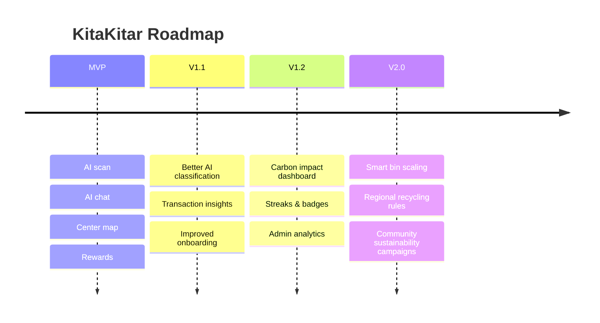

---

# 🏆 What Makes This Project Special

KitaKitar is not just a “recycling app”.

It combines:

- **AI usability**
- **real-world sustainability**
- **behavioral incentives**
- **location intelligence**
- **admin operations**
- **IoT hardware**

That makes it a strong example of a project at the intersection of:

- **AI for social good**
- **civic tech**
- **climate tech**
- **human-centered product design**

---

# 🤝 Contributors

> Our team

```md
- Moroz Fedor — Backend / Frontend
- Shawn Lee — Hardware / Smart Bin
- Jing Xian — Presentation / Documentation
- Hao Wen Chan — Presentation / Documentation
```


<div align="center">

## ♻️ Gamify your routine and build lasting recycling habits.  
## 🌍 Turn reducing waste into a winning streak.  
## 🤖 Let AI do the sorting while you rack up the rewards.

**KitaKitar — Gamifying How We Recycle. Together.**

</div>
